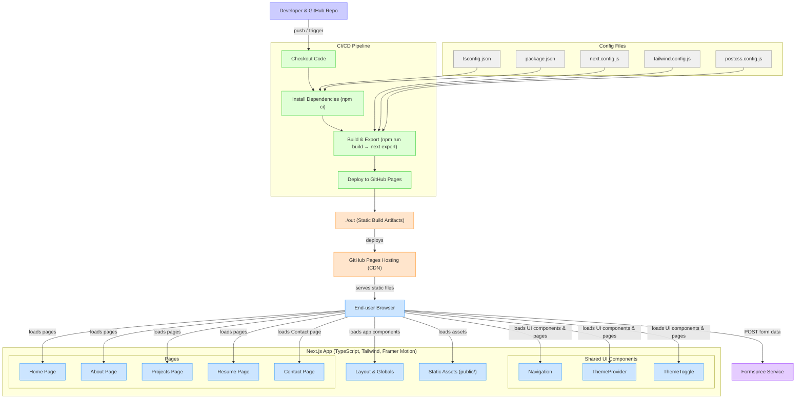

# Brian Denis Castelino - Portfolio Website

[](https://github.com/bcastelino/bcastelino.github.io/actions/workflows/main.yml)
[](https://bcastelino.github.io)

A modern, responsive personal portfolio website built with Next.js 14, TypeScript, and Tailwind CSS. This website showcases my work as a Data Analyst and AI Enthusiast, featuring a clean design with dark mode support and smooth animations.

**🌐 Live Site**: [https://bcastelino.github.io](https://bcastelino.github.io)

## 🌟 Features

- **Modern Design**: Clean, professional layout with gradient backgrounds and glassmorphism effects
- **Dark Mode**: Toggle between light and dark themes with system preference detection
- **Responsive**: Fully responsive design that works on all device sizes
- **Smooth Animations**: Framer Motion animations for enhanced user experience
- **Contact Form**: Integrated contact form powered by Formspree
- **Resume Download**: Direct access to downloadable resume
- **Projects Showcase**: Dedicated section for highlighting key projects
- **Static Export**: Optimized for GitHub Pages deployment
- **Automatic Deployment**: GitHub Actions workflow for seamless updates

## 🛠️ Tech Stack

- **Framework**: [Next.js 14](https://nextjs.org/) with App Router
- **Language**: [TypeScript](https://www.typescriptlang.org/)
- **Styling**: [Tailwind CSS](https://tailwindcss.com/)
- **Animations**: [Framer Motion](https://www.framer.com/motion/)
- **Icons**: [Heroicons](https://heroicons.com/)
- **Form Handling**: [Formspree React](https://formspree.io/)
- **Deployment**: GitHub Pages with GitHub Actions
- **Package Manager**: npm

## 📁 Project Structure

```
bcastelino.github.io/
├── .github/workflows/
│   └── main.yml                 # GitHub Actions deployment workflow
├── app/                         # Next.js App Router directory
│   ├── globals.css              # Global styles and Tailwind imports
│   ├── layout.tsx               # Root layout with navigation and theme
│   ├── page.tsx                 # Homepage with hero section
│   ├── Navigation.tsx           # Navigation component with mobile menu
│   ├── ThemeProvider.tsx        # Theme context provider
│   ├── ThemeToggle.tsx          # Dark/light mode toggle
│   ├── about/
│   │   └── page.tsx             # About page with background and education
│   ├── contact/
│   │   └── page.tsx             # Contact page with form integration
│   ├── projects/
│   │   └── page.tsx             # Projects showcase page
│   └── resume/
│       └── page.tsx             # Resume page with download link
├── public/                      # Static assets
│   ├── .nojekyll                # GitHub Pages configuration
│   ├── certificates/            # Certificate images
│   ├── logos/                   # Institution and company logos
│   ├── personal/                # Profile photo and resume PDF
│   └── projects/                # Project screenshots
├── next.config.js               # Next.js configuration for static export
├── tailwind.config.js           # Tailwind CSS configuration
├── tsconfig.json                # TypeScript configuration
├── package.json                 # Dependencies and scripts
└── package-lock.json            # Locked dependency versions
```
## 🔄 Portfolio WorkFlow

## � Available Scripts

- **`npm install`** - Install dependencies and generate package-lock.json
- **`npm run dev`** - Start development server (http://localhost:3000)
- **`npm run build`** - Build for production (outputs to `./out`)
- **`npm run start`** - Start production server
- **`npm run lint`** - Run ESLint for code quality

## 🚀 Getting Started

### Prerequisites

- Node.js 18.0 or later
- npm package manager

### Local Development

1. **Clone the repository**
   ```bash
   git clone https://github.com/bcastelino/bcastelino.github.io.git
   cd bcastelino.github.io
   ```

2. **Install dependencies**
   ```bash
   npm install
   ```

3. **Start the development server**
   ```bash
   npm run dev
   ```

4. **Open your browser**
   Navigate to [http://localhost:3000](http://localhost:3000) to see the website

### Production Deployment

The site automatically deploys to GitHub Pages when you push to the main branch. The deployment process:

1. **GitHub Actions triggers** on push to main
2. **Builds the Next.js app** using `npm run build`
3. **Exports static files** to `./out` directory
4. **Deploys to GitHub Pages** at https://bcastelino.github.io

## 📦 Build and Deployment

### Local Build

```bash
# Install dependencies
npm install

# Build for production
npm run build

# Start production server
npm start
```

### GitHub Pages Deployment

This project is configured for automatic deployment to GitHub Pages using GitHub Actions:

1. **Push to main branch** - GitHub Actions automatically builds and deploys
2. **Static export** - Next.js exports static HTML/CSS/JS files to `./out` directory
3. **Live deployment** - Site is available at https://bcastelino.github.io

**Deployment Workflow** (`.github/workflows/main.yml`):
- ✅ Node.js 20 with npm caching
- ✅ Installs dependencies with `npm ci`
- ✅ Builds with `npm run build`
- ✅ Deploys `./out` folder to GitHub Pages
- ✅ Automatic deployment on every push to main

The `next.config.js` is configured with:
- `output: 'export'` for static generation
- `trailingSlash: true` for GitHub Pages compatibility
- `images: { unoptimized: true }` for static hosting

## 🎨 Customization

### Personal Information

Update the following files with your information:

- **`app/page.tsx`** - Hero section with name and description
- **`app/about/page.tsx`** - About section, education, and experience
- **`app/projects/page.tsx`** - Projects data and descriptions
- **`app/layout.tsx`** - Site metadata and title

### Assets

Replace assets in the `public/` directory:

- **`public/personal/profile.jpg`** - Your profile photo
- **`public/personal/brian-castelino-resume.pdf`** - Your resume PDF
- **`public/projects/`** - Project screenshots
- **`public/logos/`** - Institution/company logos

### Contact Form

The contact form uses Formspree. Update the form ID in `app/contact/page.tsx`:

```typescript
const [state, handleSubmit] = useForm("YOUR_FORMSPREE_ID");
```

### Styling

- **Colors**: Modify gradient colors in Tailwind classes
- **Fonts**: Update font imports in `app/layout.tsx`
- **Animations**: Customize Framer Motion animations in components

## 📝 Available Scripts

- **`npm install`** - Install dependencies and generate package-lock.json
- **`npm run dev`** - Start development server (http://localhost:3000)
- **`npm run build`** - Build for production (outputs to `./out`)
- **`npm run start`** - Start production server
- **`npm run lint`** - Run ESLint for code quality

## 🧩 Key Components

### Navigation
- Responsive navigation with mobile hamburger menu
- Active state management
- Dark mode toggle integration

### Theme System
- Context-based theme management
- System preference detection
- Smooth theme transitions

### Contact Form
- Real-time form validation
- Success/error state handling
- Formspree integration for email delivery

### Animations
- Page load animations
- Scroll-triggered animations
- Hover effects and transitions

## 📱 Responsive Design

The website is fully responsive with breakpoints:
- **Mobile**: < 640px
- **Tablet**: 640px - 1024px
- **Desktop**: > 1024px

## 🔧 Configuration Files

- **`next.config.js`** - Next.js configuration for static export and GitHub Pages
- **`tailwind.config.js`** - Tailwind CSS configuration with dark mode support
- **`tsconfig.json`** - TypeScript compiler options
- **`postcss.config.js`** - PostCSS configuration for Tailwind processing
- **`package.json`** - Project dependencies and npm scripts
- **`package-lock.json`** - Locked dependency versions for consistent builds
- **`.github/workflows/main.yml`** - GitHub Actions deployment workflow
- **`public/.nojekyll`** - Prevents Jekyll processing on GitHub Pages

## 📊 Deployment Status

You can monitor the deployment status:
- **Actions Tab**: Visit the [Actions tab](https://github.com/bcastelino/bcastelino.github.io/actions) to see build logs
- **Live Site**: https://bcastelino.github.io
- **Build Badge**: 

## 📄 License

This project is open source and available under the [MIT License](LICENSE).

## 🤝 Contributing

This is a personal portfolio project, but suggestions and improvements are welcome:

1. Fork the repository
2. Create a feature branch
3. Commit your changes
4. Push to the branch
5. Open a Pull Request

## 📧 Contact

Brian Denis Castelino
- **Portfolio**: [bcastelino.github.io](https://bcastelino.github.io)
- **Email**: Use the contact form on the website
- **GitHub**: [@bcastelino](https://github.com/bcastelino)

---

Built with ❤️ using Next.js, TypeScript, and Tailwind CSS
