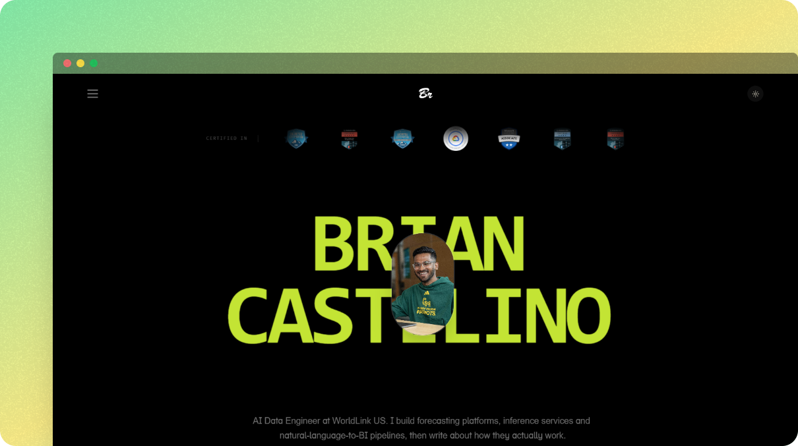

<div align="center">

<p align="center">
  <a href="https://bcastelino.com/">
    
  </a>
</p>

---

[](https://github.com/bcastelino/bcastelino.github.io/actions/workflows/main.yml)
[](https://bcastelino.com)

> A single-page, scroll-driven portfolio built with **Next.js 14**, **TypeScript**, **Tailwind CSS**, **Framer Motion** and **GSAP ScrollTrigger**. Statically exported and deployed to GitHub Pages via GitHub Actions.

</div>

---

<p align="center">
  <a href="https://bcastelino.com/">
    
  </a>
</p>

## ✨ Highlights

- **Story-scroll sections**: GSAP ScrollTrigger pin + rotate-in choreography (skipped on touch devices and `prefers-reduced-motion`)
- **Interactive WebGL footer**: custom GLSL dot-matrix with a mouse-reactive reveal, synced to the light/dark theme
- **Motion system**: Framer Motion reveals with premium MD3 easing curves and press feedback on interactive elements
- **Accessibility-first**: global reduced-motion support, visible focus rings on every interactive element, and a single accessible `<h1>`
- **SEO & AI-ready**: JSON-LD, canonical URLs, `robots.txt`, `sitemap.xml`, and an `llms.txt` knowledge file for AI assistants

---

## 🛠️ Tech Stack

| Concern              | Choice                                                  |
| -------------------- | ------------------------------------------------------- |
| Framework            | [Next.js 14](https://nextjs.org/) (App Router)          |
| Language             | [TypeScript](https://www.typescriptlang.org/)           |
| Styling              | [Tailwind CSS](https://tailwindcss.com/) + CSS vars     |
| Reveal animations    | [Framer Motion](https://www.framer.com/motion/)         |
| Scroll choreography  | [GSAP](https://gsap.com/) + ScrollTrigger + `@gsap/react` |
| WebGL shader         | [three](https://threejs.org/) + [@react-three/fiber](https://docs.pmnd.rs/react-three-fiber) |
| Icons                | [lucide-react](https://lucide.dev/)                     |
| Contact form         | [@formspree/react](https://formspree.io/)               |
| Fonts                | `next/font/google` - Inter + Fira Code                  |
| Hosting              | GitHub Pages (static export)                            |
| CI/CD                | GitHub Actions                                          |

---

## 🚀 Getting Started

```bash
git clone https://github.com/bcastelino/bcastelino.github.io.git
cd bcastelino.github.io
npm install
npm run dev        # http://localhost:3000
```

| Command         | Purpose                                     |
| --------------- | ------------------------------------------- |
| `npm run dev`   | Start dev server with HMR                   |
| `npm run build` | Static export → `./out` for GitHub Pages    |
| `npm run start` | Serve the production build locally          |
| `npm run lint`  | Run `next lint`                             |

> All content lives in **`app/lib/data.ts`** - edit the arrays/objects and the site updates automatically.

---

## 📄 License

Open source under the [MIT License](LICENSE.txt).

---

## 🐱‍👤 Author

<table>
   <tr>
      <td>
         
      </td>
      <td>
         <h1>Brian Denis Castelino</h1>
         <p><strong>AI Data Engineer · Data Analytics · GenAI</strong></p>
         <p>I turn vague ideas into clean, working systems - because someone's got to 🤖</p>
         <p>
            <a href="https://github.com/bcastelino" target="_blank">GitHub</a> ·
            <a href="https://linkedin.com/in/cas7elino" target="_blank">LinkedIn</a> ·
            <a href="https://twitter.com/cas7elino" target="_blank">Twitter / X</a> ·
            <a href="mailto:contact@bcastelino.com">Email</a>
         </p>
      </td>
   </tr>
</table>

---

Built with ❤️ using Next.js, TypeScript, Tailwind CSS, Framer Motion, GSAP, and three.js.
